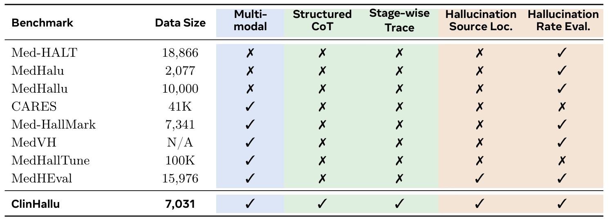
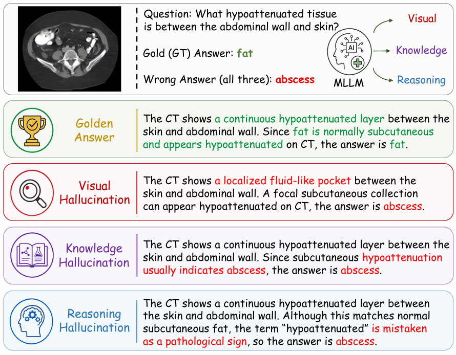

<p align="center">
  
</p>

<h3 align="center">
  CLINHALLU: A Benchmark for Diagnosing Stage-Wise Hallucinations in Medical MLLM Reasoning
</h3>

<p align="center">
  <a href="https://arxiv.org/abs/2606.14697" target="_blank">📃 Paper</a> •
  <a href="https://huggingface.co/datasets/Alibaba-DAMO-Academy/ClinHallu" target="_blank">🤗 ClinHallu Benchmark</a>
</p>

<p align="center">
  
  
  
</p>

---

## News
- **[2026.06.12]** Paper released on arXiv: [ClinHallu Paper Link](https://arxiv.org/abs/2606.14697).
- **[2026.06.12]** Dataset released.
- **[2026.06.12]** Evaluation code released.

## Overview

As illustrated below, ClinHallu is a medical MLLM benchmark and evaluation pipeline for diagnosing stage-wise hallucinations with multimodal questions, structured CoT annotations, and fine-grained step traces.

Figure (a) shows that ClinHallu unifies capabilities that are usually scattered across prior medical hallucination benchmarks, while Figure (b) illustrates three hallucination sources in the reasoning process: visual hallucination, knowledge hallucination, and reasoning hallucination.

<p align="center">
  
</p>
<p align="center"><em>Figure (a). ClinHallu compared with prior medical hallucination benchmarks.</em></p>

<p align="center">
  
</p>
<p align="center"><em>Figure (b). Example of visual, knowledge, and reasoning hallucinations in ClinHallu.</em></p>

## Benchmark Results

Accuracy and stage-wise hallucination rates on ClinHallu. We report answer accuracy (`Acc`) and hallucination rates for visual recognition ($H^V$), knowledge recall ($H^K$), and reasoning integration ($H^R$). Bold values keep the original best-within-group highlighting.

### Quick View

| Model | Avg Acc↑ | Avg $H^V$↓ | Avg $H^K$↓ | Avg $H^R$↓ |
| --- | ---: | ---: | ---: | ---: |
| Qwen3-VL-Flash | 63.6 | 52.1 | 20.0 | 7.6 |
| Qwen3-VL-Plus | 67.2 | 47.2 | 12.5 | 4.7 |
| Gemini-3-Flash | **80.1** | **25.8** | **4.0** | **2.3** |
| Qwen2.5-VL-7B | 42.7 | 65.9 | 45.5 | 18.1 |
| Qwen3-VL-8B | 51.5 | 60.5 | 33.2 | 7.8 |
| Lingshu-7B | 52.7 | 52.2 | 27.3 | 13.6 |
| MedGemma-4B | 53.2 | 51.1 | 33.4 | 30.5 |
| InternVL3.5-8B | 53.9 | 45.6 | 26.6 | 6.6 |
| Qwen3-VL-32B | 63.8 | 50.8 | 18.8 | **4.4** |
| Qwen3.5-4B | 64.3 | 52.0 | 30.5 | 5.1 |
| Qwen3.5-9B | **69.1** | **41.9** | **18.7** | 4.8 |

<details>
<summary><strong>Per-dataset breakdown</strong></summary>

### VQA-RAD

| Model | Acc↑ | $H^V$↓ | $H^K$↓ | $H^R$↓ |
| --- | ---: | ---: | ---: | ---: |
| Qwen3-VL-Flash | 70.9 | 50.7 | 9.2 | 6.8 |
| Qwen3-VL-Plus | 74.2 | 44.5 | 6.8 | 3.9 |
| Gemini-3-Flash | **82.5** | **22.9** | **3.6** | **3.0** |
| Qwen2.5-VL-7B | 54.9 | 59.4 | 34.1 | 12.5 |
| Qwen3-VL-8B | 65.0 | 57.0 | 17.2 | 4.2 |
| Lingshu-7B | 65.3 | 45.1 | 12.2 | 8.9 |
| MedGemma-4B | 71.8 | 38.0 | 24.3 | 14.2 |
| InternVL3.5-8B | 69.7 | 35.0 | 13.7 | **2.7** |
| Qwen3-VL-32B | 78.6 | 47.8 | 9.5 | 3.0 |
| Qwen3.5-4B | 77.7 | 38.9 | 14.0 | 3.3 |
| Qwen3.5-9B | **80.4** | **32.3** | **6.2** | 3.3 |

### PathVQA

| Model | Acc↑ | $H^V$↓ | $H^K$↓ | $H^R$↓ |
| --- | ---: | ---: | ---: | ---: |
| Qwen3-VL-Flash | 72.4 | 45.7 | 13.5 | 7.0 |
| Qwen3-VL-Plus | 72.9 | 41.9 | 6.7 | 5.2 |
| Gemini-3-Flash | **81.6** | **21.5** | **2.8** | **1.9** |
| Qwen2.5-VL-7B | 46.0 | 61.2 | 38.0 | 8.4 |
| Qwen3-VL-8B | 55.0 | 55.4 | 23.4 | 5.2 |
| Lingshu-7B | 64.8 | 48.8 | 19.8 | 5.1 |
| MedGemma-4B | 60.2 | 50.1 | 29.5 | 13.6 |
| InternVL3.5-8B | 58.7 | 44.3 | 21.6 | 3.2 |
| Qwen3-VL-32B | 63.6 | 47.7 | **11.4** | **2.2** |
| Qwen3.5-4B | 69.7 | 50.3 | 24.2 | 2.7 |
| Qwen3.5-9B | **72.7** | **34.7** | 14.2 | **2.2** |

### MedFrameQA

| Model | Acc↑ | $H^V$↓ | $H^K$↓ | $H^R$↓ |
| --- | ---: | ---: | ---: | ---: |
| Qwen3-VL-Flash | 64.0 | 51.0 | 17.8 | 9.1 |
| Qwen3-VL-Plus | 65.9 | 46.7 | 10.9 | 7.6 |
| Gemini-3-Flash | **71.3** | **31.0** | **5.5** | **3.0** |
| Qwen2.5-VL-7B | 45.3 | 64.8 | 43.9 | 29.1 |
| Qwen3-VL-8B | 53.9 | 58.2 | 32.6 | 14.7 |
| Lingshu-7B | 53.0 | 49.4 | 25.6 | 23.5 |
| MedGemma-4B | 54.6 | 52.3 | 30.1 | 32.4 |
| InternVL3.5-8B | 60.5 | **40.8** | 21.1 | 10.2 |
| Qwen3-VL-32B | 65.7 | 49.7 | **16.3** | 9.4 |
| Qwen3.5-4B | 66.0 | 53.0 | 29.7 | 8.6 |
| Qwen3.5-9B | **70.7** | 41.5 | 18.6 | **8.1** |

### MedXpertQA

| Model | Acc↑ | $H^V$↓ | $H^K$↓ | $H^R$↓ |
| --- | ---: | ---: | ---: | ---: |
| Qwen3-VL-Flash | 47.1 | 61.1 | 39.4 | 7.4 |
| Qwen3-VL-Plus | 55.9 | 55.8 | 25.6 | 2.1 |
| Gemini-3-Flash | **85.0** | **27.6** | **4.2** | **1.3** |
| Qwen2.5-VL-7B | 24.7 | 78.2 | 65.8 | 22.3 |
| Qwen3-VL-8B | 32.0 | 71.4 | 59.7 | 7.0 |
| Lingshu-7B | 27.7 | 65.6 | 51.5 | 16.9 |
| MedGemma-4B | 26.4 | 64.1 | 49.8 | 61.7 |
| InternVL3.5-8B | 26.5 | 62.5 | 49.9 | 10.2 |
| Qwen3-VL-32B | 47.2 | **58.1** | 37.8 | **3.1** |
| Qwen3.5-4B | 43.8 | 66.0 | 54.2 | 5.9 |
| Qwen3.5-9B | **52.6** | 58.9 | **35.8** | 5.6 |

</details>

## Recommended End-to-End Order

For one dataset and one test model, a typical run order is:

1. Install dependencies and configure `configs/config.yaml`.
2. Download the released gold benchmark JSON from Hugging Face.
3. Prepare the corresponding `images/` directory with `convert_xxx.sh`.
4. Run baseline model CoT generation.
5. Run replace experiments.
6. Run answer-accuracy evaluation.
7. Run step-level hallucination evaluation.
8. Export final results.

## 0. Setup

Install the dependencies required by the current scripts:

```bash
pip install openai pyyaml datasets huggingface_hub pyarrow vllm
```

Reference environment used in our setup:

- Conda environment: `qwen`
- Python: `3.11`
- `torch`: `2.10.0`
- `torchvision`: `0.25.0`
- `vllm`: `0.19.1`
- `transformers`: `5.5.4`

Then edit `configs/config.yaml` to set:

- API endpoints and keys under `api`, `model_registry`, and `judge_registry`
- The default `models.gold_cot`, `models.model_cot`, and `models.judge`
- The dataset entry you want to run under `datasets`

Useful dataset keys already registered in the config:

- `vqa-rad-test`
- `pathvqa-test`
- `medframeqa-test`
- `medxpert-test`

## 1. Data Preparation

### 1.1 Gold Benchmark JSON

| Dataset | 🤗 Huggingface Hub |
| --- | ---: |
| ClinHallu | [Alibaba-DAMO-Academy/ClinHallu](https://huggingface.co/datasets/Alibaba-DAMO-Academy/ClinHallu) |


Download the released ClinHallu benchmark package from Hugging Face and restore it into the local `results/` layout expected by the pipeline:

```bash
hf download Alibaba-DAMO-Academy/ClinHallu \
  --repo-type dataset \
  --local-dir clinhallu_dataset/
```

This command downloads the released ClinHallu dataset package to a local directory. Then restore the downloaded package into the local `results/` layout expected by the pipeline:

```bash
python3 clinhallu_dataset/import_hf_to_results.py \
  --hf-dir clinhallu_dataset \
  --output-root results
```

After restoration, the released `gold_cot.jsonl` files should be available at:

- `results/<dataset_key>/gold/<resolved_gold_model_name>/gold_cot.jsonl`

This file is the authoritative released benchmark input for the rest of the pipeline. In the current code, model CoT generation, replace experiments, and step-level hallucination evaluation all read from `gold_cot.jsonl`.

### 1.2 Images

Prepare images with the provided conversion scripts:

```bash
bash scripts/data_preparation/convert_vqarad.sh
bash scripts/data_preparation/convert_pathvqa.sh
bash scripts/data_preparation/convert_medframeqa.sh
bash scripts/data_preparation/convert_medxpert.sh
```

These scripts are used to prepare the image files needed by the benchmark:

- `data/<dataset>/input/<split>/images/`

The source HuggingFace datasets used by the current converters are:

| Dataset | 🤗 Huggingface Hub |
| --- | ---: |
| VQA-RAD | [flaviagiammarino/vqa-rad](https://huggingface.co/datasets/flaviagiammarino/vqa-rad) |
| PathVQA | [flaviagiammarino/path-vqa](https://huggingface.co/datasets/flaviagiammarino/path-vqa) |
| MedFrameQA | [SuhaoYu1020/MedFrameQA](https://huggingface.co/datasets/SuhaoYu1020/MedFrameQA) |
| MedXpertQA-MM | [TsinghuaC3I/MedXpertQA](https://huggingface.co/datasets/TsinghuaC3I/MedXpertQA) |

In the benchmark-release setting, only the released `gold_cot.jsonl` comes from HuggingFace. The conversion scripts are mainly used to populate the corresponding `images/` directory.

## 2. Generate Model CoT

For one dataset-model run, start the matching `vLLM` server(s) first if you use local models.

Example for `qwen3.5-9b-local`:

```bash
CUDA_VISIBLE_DEVICES=0,1,2,3 vllm serve ./model_cache/Qwen3.5-9B \
  --served-model-name Qwen3.5-9B \
  --host 0.0.0.0 \
  --port 8001 \
  --max-model-len 65536 \
  --gpu-memory-utilization 0.85 \
  --tensor-parallel-size 4 \
  --trust-remote-code
```

Then make sure the config points to the same local model endpoint:

```yaml
model_registry:
  qwen3.5-9b-local:
    model_name: Qwen3.5-9B
    api:
      base_url: http://127.0.0.1:8001/v1
      api_key: "EMPTY"
```

When you start a local server, make sure `--served-model-name` matches the corresponding `model_name` in `configs/config.yaml`.

Below, we use `vqa-rad-test`, `qwen3.5-plus`, and `qwen3.5-9b-local` as the running example.

For one dataset-model run, the usual order is:

```bash
bash scripts/model_evaluation/01_generate_cot.sh configs/config.yaml model <dataset_key> <gold_model> <test_model>
```

Example:

```bash
bash scripts/model_evaluation/01_generate_cot.sh configs/config.yaml model vqa-rad-test qwen3.5-plus qwen3.5-9b-local
```

Important outputs:

- Model CoT under `results/<dataset_key>/eval/<resolved_test_model_name>/model_cot.jsonl`

Note:

- This step assumes the released gold benchmark file is already available at `results/<dataset_key>/gold/<resolved_gold_model_name>/gold_cot.jsonl`.

## 3. Replace Experiments

Generate the replace-experiment outputs with:

```bash
bash scripts/model_evaluation/03_replace_experiment.sh configs/config.yaml generate replace_all <dataset_key> <gold_model> <test_model>
```

You can also run one variant at a time:

```bash
bash scripts/model_evaluation/03_replace_experiment.sh configs/config.yaml generate replace_vr <dataset_key> <gold_model> <test_model>
bash scripts/model_evaluation/03_replace_experiment.sh configs/config.yaml generate replace_kr <dataset_key> <gold_model> <test_model>
bash scripts/model_evaluation/03_replace_experiment.sh configs/config.yaml generate replace_vr_kr <dataset_key> <gold_model> <test_model>
```

Important note:

- Use `generate` if you only want the replace jsonl outputs.
- Use `all` only if you want this wrapper to generate first and then immediately run answer judging.

The semantics are:

- `replace_vr`: replace `visual_recognition` with gold, then let the model continue
- `replace_kr`: replace `knowledge_recall` with gold, then let the model continue
- `replace_vr_kr`: replace both `visual_recognition` and `knowledge_recall` with gold, then let the model continue reasoning

Outputs are written to:

- `results/<dataset_key>/eval/<resolved_test_model_name>/replace/replace_vr.jsonl`
- `results/<dataset_key>/eval/<resolved_test_model_name>/replace/replace_kr.jsonl`
- `results/<dataset_key>/eval/<resolved_test_model_name>/replace/replace_vr_kr.jsonl`

## 4. Accuracy Evaluation

### 4.1 Deploy the Judge Model
Before running answer judging, start an OpenAI-compatible judge service and make sure `api.judge.base_url` and `models.judge` in `configs/config.yaml` match the actual deployed service.

```bash
CUDA_VISIBLE_DEVICES=0,1,2,3 vllm serve ./model_cache/Qwen3.5-27B \
  --served-model-name qwen3.5-27b \
  --host 0.0.0.0 \
  --port 8002 \
  --max-model-len 65536 \
  --gpu-memory-utilization 0.85 \
  --tensor-parallel-size 4 \
  --trust-remote-code
```

### 4.2 Baseline model accuracy

```bash
bash scripts/model_evaluation/02_judge_answers.sh configs/config.yaml model <dataset_key> <gold_model> <test_model>
```

### 4.3 Replace-experiment accuracy

```bash
bash scripts/model_evaluation/02_judge_answers.sh configs/config.yaml replace_all <dataset_key> <gold_model> <test_model>
```

You can also judge one replace variant at a time:

```bash
bash scripts/model_evaluation/02_judge_answers.sh configs/config.yaml replace_vr <dataset_key> <gold_model> <test_model>
bash scripts/model_evaluation/02_judge_answers.sh configs/config.yaml replace_kr <dataset_key> <gold_model> <test_model>
bash scripts/model_evaluation/02_judge_answers.sh configs/config.yaml replace_vr_kr <dataset_key> <gold_model> <test_model>
```

Important notes:

- Baseline summary is saved to `results/<dataset_key>/eval/<resolved_test_model_name>/judge.json`.
- Detailed per-sample judgments are saved to `results/<dataset_key>/eval/<resolved_test_model_name>/judge_details.jsonl`.
- Replace summaries are saved to `results/<dataset_key>/eval/<resolved_test_model_name>/replace/summary.json`.

## 5. Hallucination Rate Evaluation

### Fine-grained decomposition into $H^V$, $H^K$, and $H^R$

Run the three replace-based step-hallucination evaluations:

```bash
bash scripts/model_evaluation/04_judge_step_hallucination.sh configs/config.yaml replace_kr <dataset_key> <gold_model> <test_model>
bash scripts/model_evaluation/04_judge_step_hallucination.sh configs/config.yaml replace_vr <dataset_key> <gold_model> <test_model>
bash scripts/model_evaluation/04_judge_step_hallucination.sh configs/config.yaml replace_vr_kr <dataset_key> <gold_model> <test_model>
```

Example:

```bash
bash scripts/model_evaluation/04_judge_step_hallucination.sh configs/config.yaml replace_kr vqa-rad-test qwen3.5-plus qwen3.5-9b-local
bash scripts/model_evaluation/04_judge_step_hallucination.sh configs/config.yaml replace_vr vqa-rad-test qwen3.5-plus qwen3.5-9b-local
bash scripts/model_evaluation/04_judge_step_hallucination.sh configs/config.yaml replace_vr_kr vqa-rad-test qwen3.5-plus qwen3.5-9b-local
```

Read the hallucination rates as follows:

- $H^V$: use `visual_recognition.hallucination_rate` from `replace_kr_step_hallucination_judge_summary.json`
- $H^K$: use `knowledge_recall.hallucination_rate` from `replace_vr_step_hallucination_judge_summary.json`
- $H^R$: use `reasoning.hallucination_rate` from `replace_vr_kr_step_hallucination_judge_summary.json`

The intuition is:

- In `replace_kr`, knowledge recall is replaced by gold, so the remaining visual-recognition hallucination is attributed to $H^V$.
- In `replace_vr`, visual recognition is replaced by gold, so the remaining knowledge-recall hallucination is attributed to $H^K$.
- In `replace_vr_kr`, both upstream steps are replaced by gold, so the remaining reasoning hallucination is attributed to $H^R$.

The corresponding outputs are:

- `results/<dataset_key>/eval/<resolved_test_model_name>/replace/replace_kr_step_hallucination_judge_summary.json`
- `results/<dataset_key>/eval/<resolved_test_model_name>/replace/replace_vr_step_hallucination_judge_summary.json`
- `results/<dataset_key>/eval/<resolved_test_model_name>/replace/replace_vr_kr_step_hallucination_judge_summary.json`

## 6. Export Final Results

Aggregate the final summaries into comparison tables with:

```bash
bash scripts/result_analysis/make_result_tables.sh results <dataset_key>
```

This exports:

- Answer accuracy delta table
- Step hallucination base table

You can also write files explicitly:

```bash
bash scripts/result_analysis/make_result_tables.sh results <dataset_key> --output-md results/<dataset_key>/final_report.md --output-csv-dir results/<dataset_key>/tables
```

The tables read from:

- `results/<dataset_key>/eval/<resolved_test_model_name>/judge.json`
- `results/<dataset_key>/eval/<resolved_test_model_name>/replace/summary.json`
- `results/<dataset_key>/eval/<resolved_test_model_name>/replace/*_step_hallucination_judge_summary.json`

## Notes

- `replace_all` is convenient for generation and answer judging, but for the $H^V / H^K / H^R$ decomposition you should read the three individual replace summaries separately.
- Dataset selection is controlled by `--dataset-key`, and the actual input paths are taken from the matching entry in `configs/config.yaml`.
- Result directories use the resolved model names from the config registry, not necessarily the registry keys you pass on the command line.

## 📜 Citation

If you find ClinHallu useful for your research and applications, please cite using this BibTeX:

```bibtex
@misc{yang2026clinhallu,
  title={CLINHALLU: A Benchmark for Diagnosing Stage-wise Hallucinations in Medical MLLM Reasoning},
  author={Sicheng Yang and Hangjie Yuan and Wenjun Zhang and Jinwang Wang and Yichen Qian and Weihua Chen and Fan Wang and Lei Zhu},
  year={2026},
  note={Preprint.}
}
```
